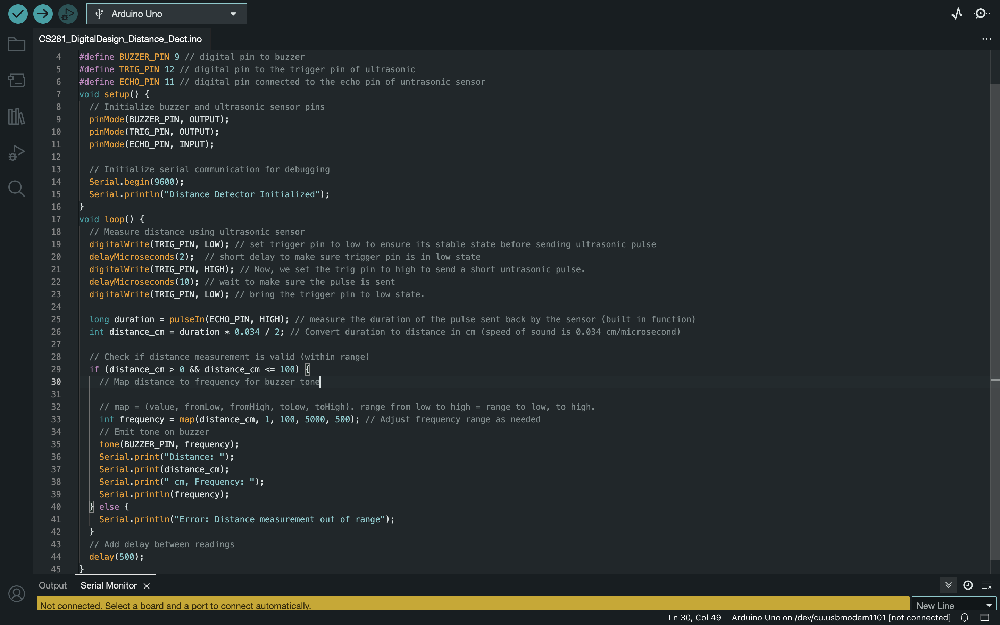

# Lab 4: Sensors and Actuators

## Overview and Motivation
This week we'll explore...

## Materials

## Project Steps
### Overview of Buzzer and Ultrasonic Sensor

### Design Challenge
#### Overview 
We built a handheld proximity detector that emits a sound whose pitch correlates with the distance to a nearby object. There were a few requirements we needed to to hit to make this a proper **Distance Detector**.

 -  We need to make sure that our device (Distance Detector) should be sensitive to and respond correspondingly to distances that span from vary close (1 cm or less) to a distance of 100 cm (1 meter).

 - We also need to make sure our device emits a sound tone in relation to the distance. For example, we used a low-pitched tone to indicate a far distance (100cm). Similarly, we used a high-pitched tone to indicate a near distance (1 cm or less). This means, we also need to make sure that we are emiting sound in relation to the distance i.e. how far an object is or how close it is, should have different and unique sound tones in relation to one another.

 
#### Arduino Code and Explanation

**Code Implementation:** As mentioned before, One of the most important part of this **Distance Detector** was to implement the correct Arduino Code written in **C** to make sure it functions as intended and fulfills the requirements of this lab. To write this code, we used the help of the code we implemented previously to make sure our Buzzer and our Ultrasonic Sensor functions properly. 

**C Code For Distance Detector:** This is the following code we used in Arduino IDE:

// Define buzzer and ultrasonic sensor pins

#define BUZZER_PIN 9 
#define TRIG_PIN 12 
#define ECHO_PIN 11  

void setup() {

  pinMode(BUZZER_PIN, OUTPUT);
  pinMode(TRIG_PIN, OUTPUT);
  pinMode(ECHO_PIN, INPUT);
  

  // Initialize serial communication for debugging
  Serial.begin(9600);
  Serial.println("Distance Detector Initialized");

}

void loop() {

  digitalWrite(TRIG_PIN, LOW); 
  delayMicroseconds(2);  
  digitalWrite(TRIG_PIN, HIGH); 
  delayMicroseconds(10); 
  digitalWrite(TRIG_PIN, LOW); 
  

  // measure the duration of the pulse sent back by the sensor (built in function)
  long duration = pulseIn(ECHO_PIN, HIGH); 

  // Convert duration to distance in cm (speed of sound is 0.034 cm/microsecond)
  int distance_cm = duration * 0.034 / 2; 
  
  // Check if distance measurement is valid (within range)
  if (distance_cm > 0 && distance_cm <= 100) {

    // map = (value, fromLow, fromHigh, toLow, toHigh). range from low to high = range to low, to high.
    int frequency = map(distance_cm, 1, 100, 5000, 500); // Adjust frequency range as needed
    

    tone(BUZZER_PIN, frequency);

  
    // Print distance and frequency for debugging
    Serial.print("Distance: ");
    Serial.print(distance_cm);
    Serial.print(" cm, Frequency: ");
    Serial.println(frequency);

  } else {

    Serial.println("Error: Distance measurement out of range");
  }
  
  // Add delay between readings
  delay(500);
}

#### Wiring Steps
**Steps:** Having built a Buzzer and Ultrasonic Sensor before working on this Digital Design was a very big help. After independantly building each of these Sensors in our Arduino Breadboard, and learning how they function using the Arduino Code, building the Distance Detector was much easier. This is because we had to combine the knowledge of how a buzzer works and also how the Ultrasonic Sensor works to successfully build a distance detector which has functionality of both, "a Buzzer" and "an Ultrasonic Sensor" combined.

- In Short, We used the steps needed to build a buzzer and the steps needed to build an Ultrasonic Sensor to build these in our breadboard. After this, all we needed was implement the Arduino Code to make sure it functions as intended.

#### Testing

### Additional Module: Mobile Distance Detector

## Conclusion